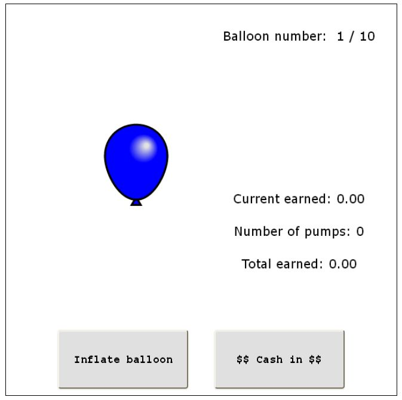
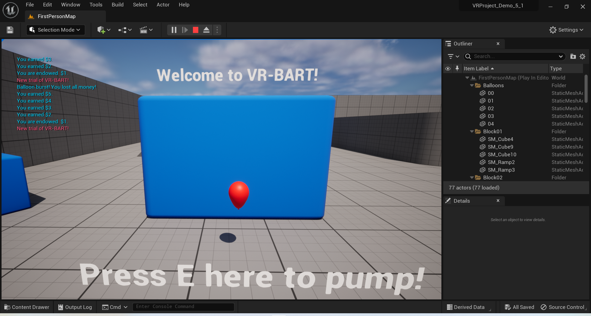
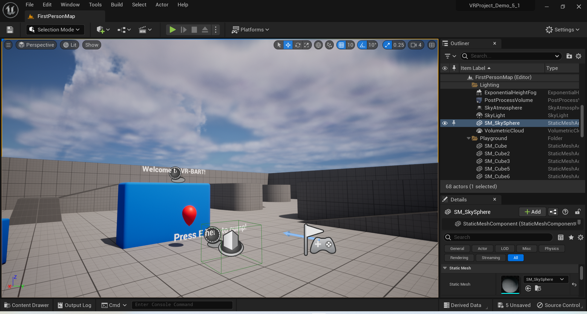
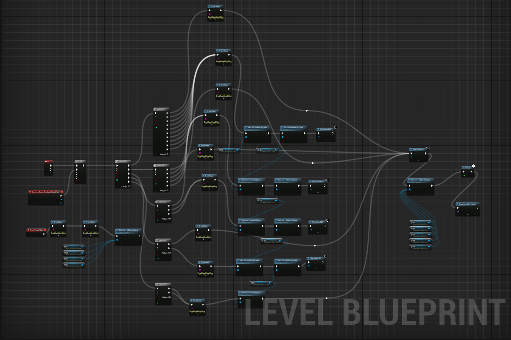
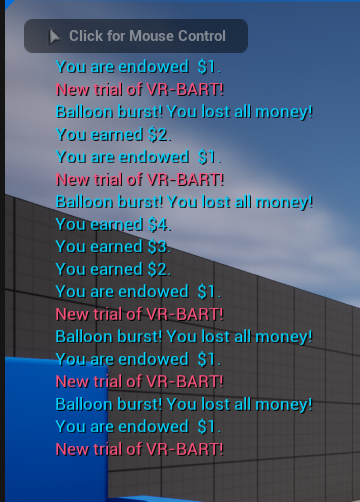

# Virtual Reality-based Balloon Analogue Risk Task (VR-BART)

## Overview

The **VR-BART Experimental Tool** is a **Virtual Reality-based Balloon Analogue Risk Task (VR-BART)** designed to study risk-taking behavior in immersive environments. Built using **Unreal Engine 5 (UE5)**, this tool provides researchers with a robust, customizable platform to analyze decision-making under risk.

Originally introduced by psychologists (Lejuez et al., 2002), the Balloon Analogue Risk Task (BART) has become a widely-used experimental paradigm in psychology and behavioral economics. This VR-based implementation enhances the traditional task by immersing participants in a virtual simulation, improving ecological validity, and enabling new layers of data collection.

---

## Use Cases

This tool is designed for:
- **Psychologists** studying risk-taking behaviors and decision-making processes.
- **Behavioral Economists** analyzing risk preferences in controlled environments.
- **Researchers** exploring VR as a medium for behavioral experiments.
- **Educators** teaching experimental psychology and behavioral economics in classrooms.

---

## How It Works

1. **Participant's Task**:
   - Inflate a virtual balloon by pressing a button.
   - Each inflation increases potential rewards but also increases the risk of explosion.
   - Participants decide how many times to inflate before stopping or risking the balloon bursting.

2. **Experimenter Setup**:
   - Configure parameters such as explosion probabilities, payoff functions, and observer presence.
   - Monitor participant performance and collect data for analysis.

3. **Data Collection**:
   - Records:
     - Number of inflations per trial.
     - Total earnings/losses.
     - Behavioral metrics indicating risk-taking tendencies.

---

## Figures

### Figure 1: Traditional computerized BART experiment.

### Figure 2: VR-BART overview in UE5 “Play In Editor” mode.

### Figure 3: VR-BART overview in UE5 “Editor” mode.

### Figure 4: VR-BART UE5 level Blueprint overview.

### Figure 5: Outcome text printed on screen in trials.

